# GeeksterPlacementModule-ReactTaskBasedQuestions

# 10 ReactJS Task based Question | Geekster Placement Module #7
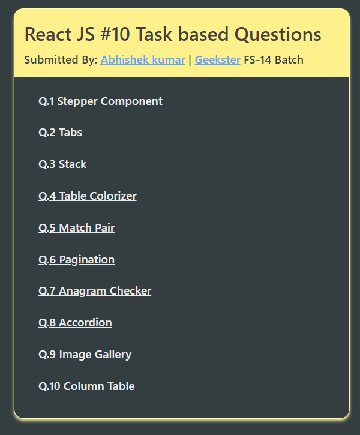

## Hosted Version of the Project:
[10 Solved ReactJS Task based Questions by Abhishek kumar](https://alex21c.github.io/GeeksterPlacementModule-ReactTaskBasedQuestions/)

## Tech. Stack Used:

- [ReactJS](https://react.dev/)
- [Material UI](https://mui.com/material-ui/)
- [HTML5](https://en.wikipedia.org/wiki/HTML5)
- [CSS3](https://en.wikipedia.org/wiki/CSS)
- [TailwindCSS](https://tailwindcss.com/)

## Author

[Abhishek kumar](https://www.linkedin.com/in/alex21c/), ([Geekster](https://geekster.in/) MERN Stack FS-14 Batch)

## Screenshots
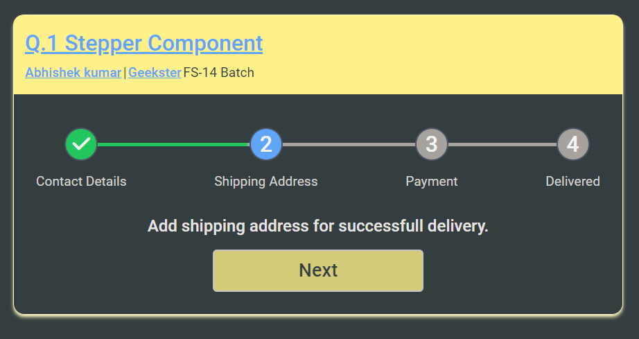
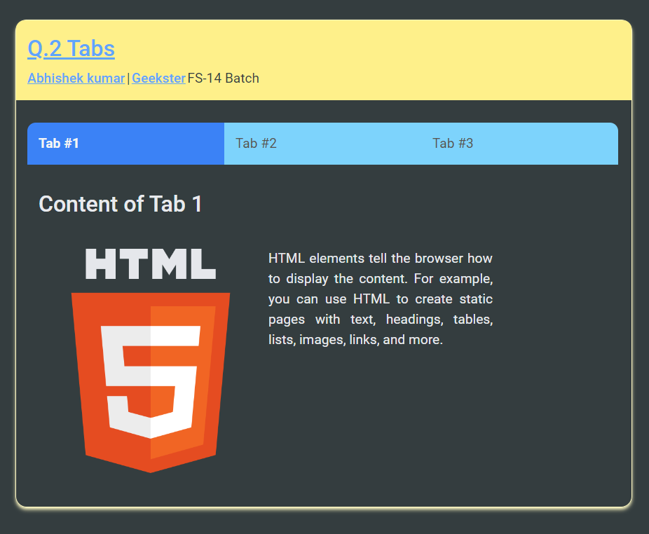
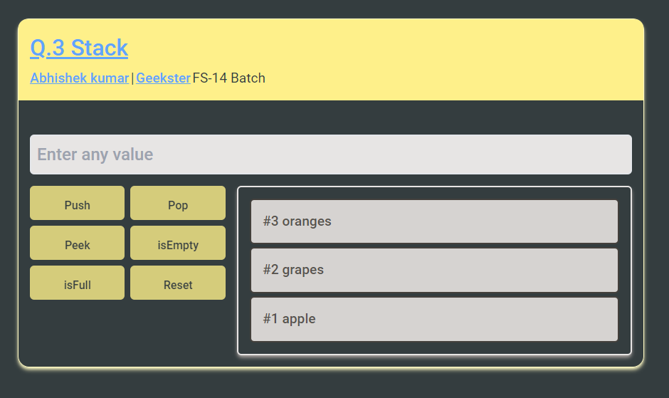
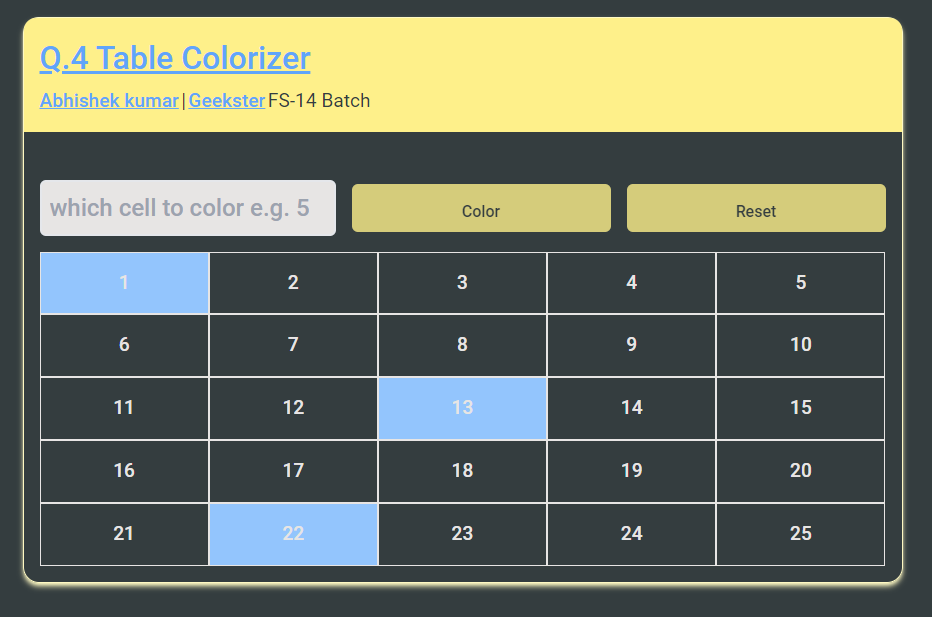
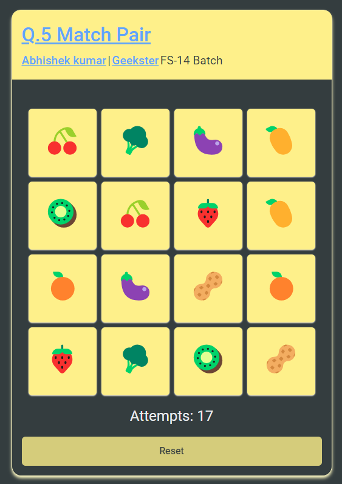
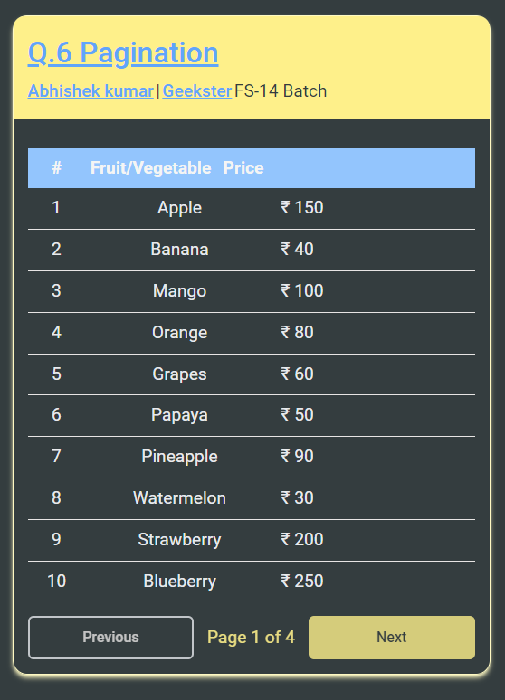
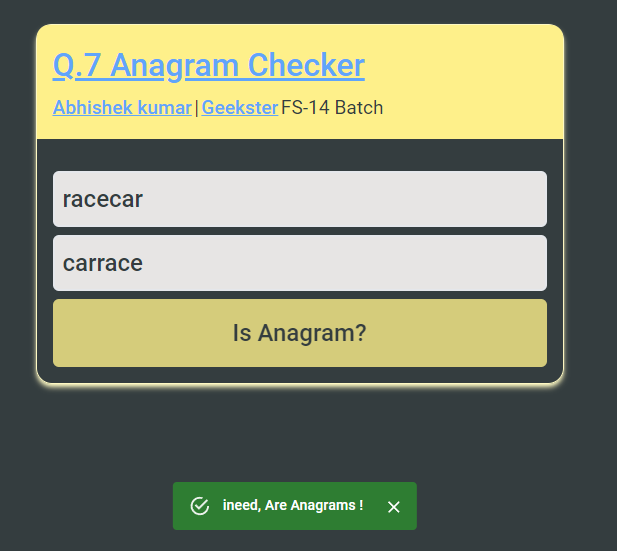
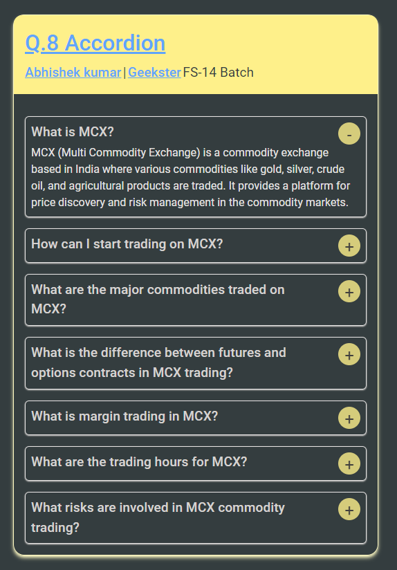
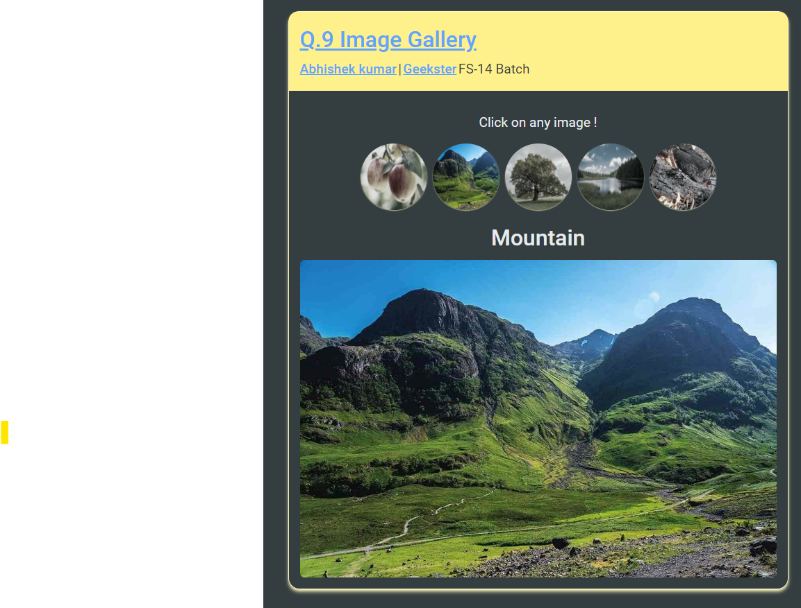
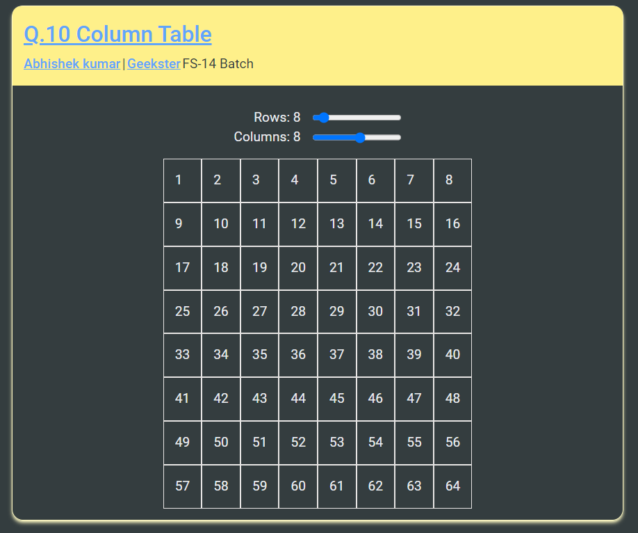

