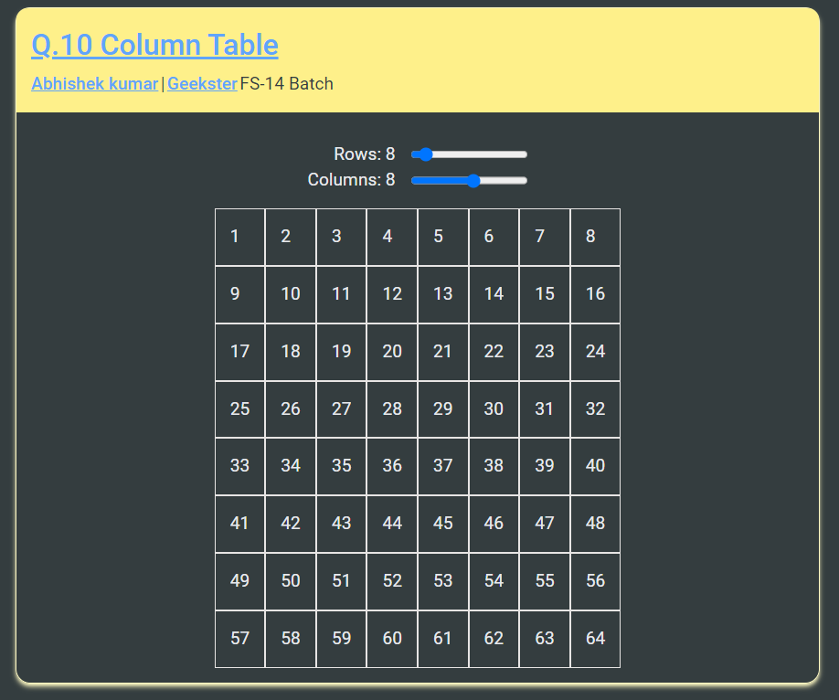

# Q.10 Column Table



## Hosted Version of the Project:

[Q.10 Column Table](https://q10-column-table.netlify.app/)

## How to install and run in yours local machine

```bash
npm install
npm run start
```

## Tech. Stack Used:

- [React](https://react.dev/)
- [TailwindCSS](https://tailwindcss.com/)
- [Google Fonts](https://fonts.google.com/)
- [Font Awesome](https://fontawesome.com/icons/)

## Author

[Abhishek kumar](https://www.linkedin.com/in/alex21c/), ([Geekster](https://geekster.in/) MERN Stack FS-14 Batch)
